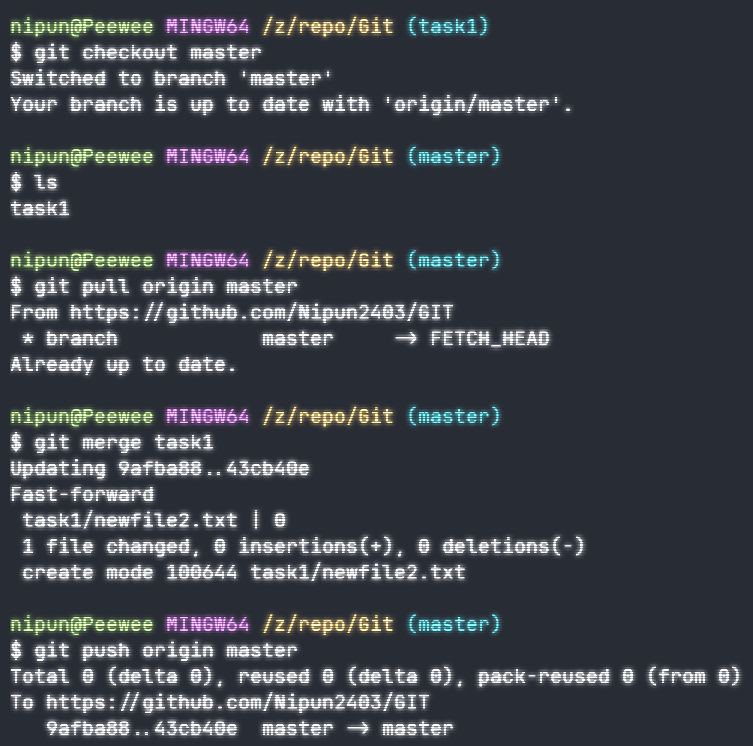

# Task 1 - Initialize, Commit, and Branch Basics

## Commands Used

### 1. Create Repo

I. Initialize the Repo

```bash
  git init
```

II. Add the files

```bash
  git add .
```

III. Commit Changes

```bash
  git commit -m "Commit Message"
```

IV. Link to remote repo

```bash
  git remote add origin <url of repo from github>
```

V. Push changes to remote repo

```bash
  git push -u origin master(branch name)
```

### 2. Create New Branch

```bash
git checkout -b task1
```

### 3. Merge Branch

I. Go to Master/Main Branch

```bash
git checkout master
```

II. Pull the new changes, if any (optional)

```bash
git pull origin master
```

III. Merge Master/Main with branch

```bash
git merge NameOfBranch
```

IV. Push the changes

```bash
git push origin master
```


