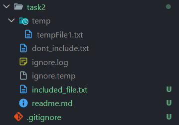
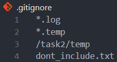
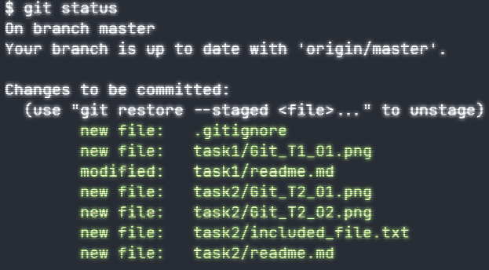

# Task 2 - Using .gitignore and Tracking Files

### File Structure

#### Included

- readme.md
- included_file.txt

#### Ignored

- dont_include.txt
- temp folder and files indside it (tempFile1.txt)

### Git Ignore

- \*.log : Ignore all files ending with .log
- \*.temp : Ignore all files ending with .temp
- /task2/temp : Ignore all the files and the folder "temp" inside "task2"
- dont include the specific file "dont_include.txt"

### Git Status

