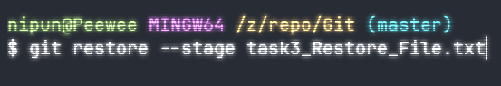

# Task 3 - Undoing Changes and Reverting Commits

## Commands Used

### 1. Remove a file from staging (locally)

```bash
git restore --stage fileName.txt
```



### 2. Revert a file to last committed state (locally)

```bash
git restore fileName.txt
```


### 3. Revert a bad commit (Non-Destructive)

- Reverts the files back to the last state in the remote repository
- Undo all the changes made to the last commit
- Push the changes as new commit to the repository

```bash
git revert head
```


### 4. Reset a bad commit by changing commit history (Destructive)

- Completely removes the commit and the history of the commmit
- Changes the pointer to a different commit
- No going back
- Two Methods :
  1. Soft Reset
  - Work remains in staging area but commit is lost
  - Safe when compared to hard reset
  - Ex: Removes the last commit (_head_) and get back to the previous one (_head-1_)

```bash
  git reset --soft HEAD~1
```

2. Hard Reset

- Both the work and the commit is removed
- Difficult to restore

```bash
git reset --hard HEAD~1
```

## Git Revert Vs Git Reset

| Feature            | Git Revert                                                                   | Git Reset                                                                      |
| :----------------- | :--------------------------------------------------------------------------- | :----------------------------------------------------------------------------- |
| **Action**         | Creates a new "inverse" commit to undo changes.                              | Moves the branch pointer back to a previous commit.                            |
| **History**        | **Preserves history.** The "bad" commit stays; a new "undo" commit is added. | **Rewrites history.** The "bad" commit is removed from the timeline.           |
| **Safety**         | **Very Safe.** Recommended for shared/public branches.                       | **Risky.** Can cause issues if the commit was already pushed to a shared repo. |
| **Work Retrieval** | You can still see the original mistake in the logs.                          | Commits appear "deleted" (though recoverable via `reflog`).                    |
| **Use Case**       | Undoing a bug in a project your team has already pulled.                     | Cleaning up local mistakes before you share your code.                         |


