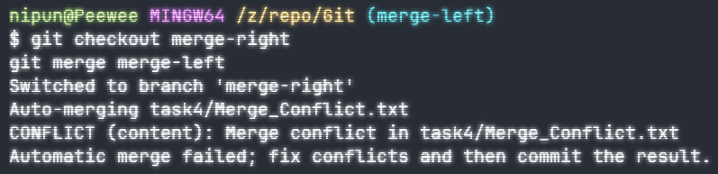

# Task 4 - Simulating and Resolving Merge Conflict

## Commands Used

### 1. Create a Merge Conflict

1.1. Create a left branch

```bash
git checkout -b merge-left
```

1.2. Edit line in file "Merge_Conflict.txt"

1.3. Add the file to stage

```bash
git add Merge_Conflict.xt
```

1.4. Commit the change

```bash
git commit -m "Left side change"
```

1.5 Create a right branch

```bash
git checkout -b merge-right
```

1.6. Edit the same line as done in 1.2 in file "Merge_Conflict.txt"
1.7. Add the file to stage

```bash
git add Merge_Conflict.xt
```

1.8. Commit the change

```bash
git commit -m "right side change"
```

1.9 Checkout to right branch

```bash
git checkout merge-right
```

1.10 Merge both left and right branch

```bash
git merge merge-left
```



### 2. Solve Merge Conflict

- Open file editor
- Fix the incoming conflict in the file
- Merge the branches
