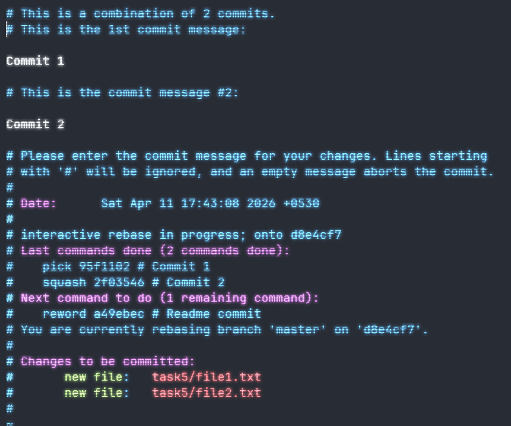
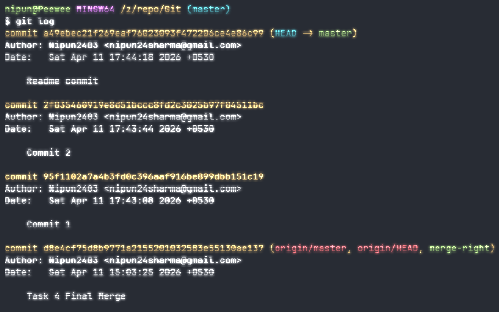
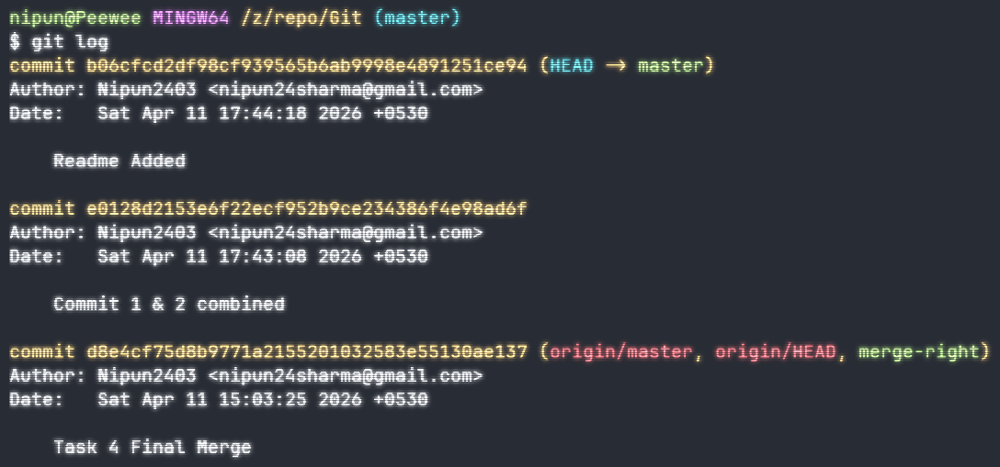

# Task 5 - Interactive Rebasing for Clean Commit History

## Commands Used

### Git Rebase

- Used to combine or tidy up multiple commits for a seamless and more reading friendly commit history.
- Functions like Combining multiple commits, renaming commits, etc can be performed to achieve such results
- Use rebase command with _-i_ flag to open up an interactive windows showing the commit
  

### Initial Commit History (git log)

### Commit History After Rebase

- Combined commmit 1 and commit 2
- Reword another commit

